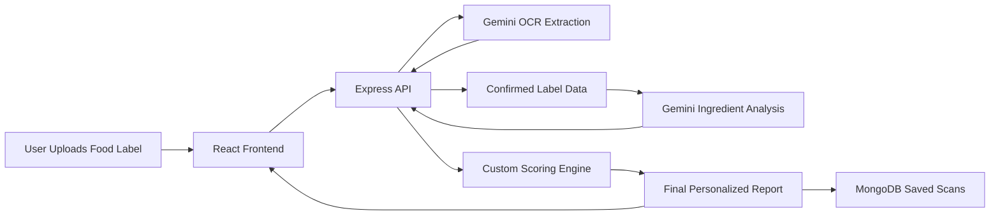
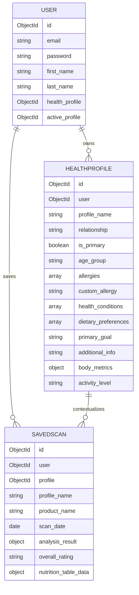

# InnerVerse

InnerVerse is a full-stack, goal-aware nutrition label analysis platform that helps people decide whether a packaged food fits their health profile, medical context, and personal nutrition goal.

At its core, InnerVerse combines:

- multimodal food-label extraction from images
- profile-based personalization
- AI-assisted ingredient interpretation
- a custom rule-based scoring algorithm
- long-term behavior tracking through history, insights, goal-match streaks, and a calendar heatmap

This repository contains both the React frontend and the Express/MongoDB backend used to power the application.

## 1. Project Vision

Most nutrition tools stop at generic calorie or ingredient reading. InnerVerse was designed to go a step further:

- not just "What is in this product?"
- but "Is this product appropriate for this specific person?"
- and now, "Does this product align with the user’s current health goal?"

The project was designed around a simple belief:

> Food decisions should be personalized, explainable, and easy to act on.

That is why InnerVerse does not only scan labels. It builds a profile-aware decision layer on top of the label.

## 2. Problem Statement

Packaged food labels are often difficult to interpret quickly, especially for:

- users managing diabetes, hypertension, kidney disease, cholesterol, or obesity
- users with allergies or sensitivities
- families shopping for different health needs
- users trying to follow a goal such as low sugar, low sodium, weight loss, or high protein

Reading raw labels is not enough. People need a system that can:

1. extract ingredient and nutrition information from an image
2. understand the user’s health context
3. score how suitable the product is
4. explain the decision in natural language
5. help the user improve consistency over time

InnerVerse was built to solve exactly that.

## 3. What The Project Does

The current implementation supports the following end-to-end flow:

1. A user registers or logs in.
2. The user creates one or more health profiles.
3. Each profile stores health context such as age group, body metrics, allergies, conditions, lifestyle context, and a primary health goal.
4. The user uploads one or two food-label images.
5. The backend sends those images to Gemini to extract:
   - ingredient list
   - nutrition facts table
6. The user reviews and confirms extracted data before analysis.
7. The backend combines:
   - extracted label data
   - AI-generated ingredient analysis
   - user health profile
   - custom rule-based scoring
8. The system returns a personalized report with:
   - overall rating
   - personal fit score
   - goal-match score
   - summary paragraph
   - moderation advice
   - alternative suggestion
   - allergen flags
   - ingredient-by-ingredient analysis
9. The user can save the scan.
10. The system tracks history, trends, goal-match streaks, and a 35-day consistency calendar.

## 4. Major Product Features

### 4.1 Authentication

- email/password registration
- secure password hashing using `bcryptjs`
- JWT-based authentication
- persistent login using client-side token storage

### 4.2 Multi-Profile Support

InnerVerse is not limited to a single user profile. It supports family-aware usage.

- primary profile for the account holder
- additional profiles for family members
- active profile switching
- separate scan history and insights per profile context

This makes the system practical for real households where different people have different dietary needs.

### 4.3 Health Profile Builder

Each profile captures:

- profile name
- relationship
- age group
- activity level
- height and weight
- BMI
- allergies
- chronic conditions
- dietary/lifestyle context
- custom notes
- primary health goal

### 4.4 AI-Powered OCR and Ingredient Extraction

Users upload one or two images, and the backend sends them to Gemini to extract:

- structured ingredient list
- structured nutrition facts table

This allows the system to work from real packaging photos instead of requiring manual data entry.

### 4.5 Personalized Food Analysis

After extraction, InnerVerse analyzes the product using both AI and deterministic rules to produce:

- overall health rating
- profile-fit score
- goal-match score
- ingredient profile distribution
- nutrient highlights
- specific warnings

### 4.6 Goal-Based Personalized Scanning

One of the most important additions in this version is goal-awareness.

Users can now choose a primary goal such as:

- Weight loss
- Muscle gain
- Low sugar
- Low sodium
- High protein
- Clean eating

Every scan is evaluated not only for general healthfulness, but also for how well it supports the selected goal.

### 4.7 Scan History and Comparison

Users can:

- save reports
- revisit previous scans
- delete scans
- compare saved products side by side

This transforms the product from a one-time scanner into a long-term decision-support system.

### 4.8 Insights, Streaks, and Calendar Tracking

InnerVerse includes a behavior-tracking layer:

- average fit score over time
- nutrient trends
- rating mix
- recurring concern signals
- goal-match streaks
- best streak
- weekly goal-match count
- a 35-day goal consistency calendar

The calendar uses:

- gray for no scan
- amber for scanned but goal not met
- green shades for increasing goal-match intensity

This makes consistency visible and presentation-friendly.

## 5. Technology Stack

### Frontend

- React 19
- Vite
- Axios
- React Router DOM
- Lucide React

### Backend

- Node.js
- Express
- MongoDB
- Mongoose
- JWT
- bcryptjs
- Multer
- Axios

### AI Layer

- Google Gemini API
- model used in code: `gemini-2.5-flash-lite`

## 6. Repository Structure

```text
Prototype1/
├── README.md
├── backend/
│   ├── middleware/
│   ├── models/
│   ├── routes/
│   ├── utils/
│   ├── package.json
│   └── server.js
└── frontend/
    ├── src/
    │   ├── components/
    │   ├── services/
    │   ├── App.jsx
    │   └── main.jsx
    ├── package.json
    └── vite.config.js
```

## 7. System Design

## 7.1 High-Level Architecture

The project follows a classic client-server architecture:

1. React frontend handles user interface and state transitions.
2. Express backend handles auth, profile management, analysis orchestration, and persistence.
3. MongoDB stores users, profiles, and saved scans.
4. Gemini provides label extraction and AI-generated ingredient analysis.

### High-Level Flow



## 7.2 Frontend View Flow

The frontend is organized as a view-driven single-page application. `App.jsx` controls the main application state and swaps between screens.

Primary views:

- `login`
- `register`
- `profile`
- `scanner`
- `confirmation`
- `results`
- `history`
- `insights`
- `compare`

## 7.3 Backend API Flow

The backend exposes separate route modules for:

- authentication
- profile management
- analysis
- saved scans

This separation keeps the application maintainable and maps cleanly to feature domains.

## 8. Database Design

MongoDB is used as the primary data store. The application centers around three main entities:

- `User`
- `HealthProfile`
- `SavedScan`

## 8.1 Entity Relationships



## 8.2 User Model

Defined in [backend/models/User.js](/Users/chaudh8ry/Desktop/Prototype1/backend/models/User.js)

Purpose:

- account identity
- authentication
- reference to default/active profile

Important behaviors:

- passwords are hashed before save
- password comparison is handled through a schema method

## 8.3 HealthProfile Model

Defined in [backend/models/HealthProfile.js](/Users/chaudh8ry/Desktop/Prototype1/backend/models/HealthProfile.js)

Purpose:

- stores all health context used during scoring
- supports multiple profiles per user
- stores primary goal for goal-aware analysis

Important fields:

- `profile_name`
- `relationship`
- `is_primary`
- `age_group`
- `allergies`
- `health_conditions`
- `dietary_preferences`
- `primary_goal`
- `body_metrics`
- `activity_level`

## 8.4 SavedScan Model

Defined in [backend/models/SavedScan.js](/Users/chaudh8ry/Desktop/Prototype1/backend/models/SavedScan.js)

Purpose:

- stores fully generated reports
- powers history, insights, streaks, and calendar analytics

Important fields:

- `analysis_result`
- `overall_rating`
- `nutrition_table_data`
- `profile`
- `scan_date`

## 9. API Design

## 9.1 Auth Routes

- `POST /api/auth/register`
- `POST /api/auth/login`
- `GET /api/auth/me`

## 9.2 Profile Routes

- `POST /api/profile`
- `GET /api/profile`
- `POST /api/profile/active/:id`
- `DELETE /api/profile/:id`

## 9.3 Analysis Routes

- `POST /api/analysis/extract-ingredients`
- `POST /api/analysis/analyze-ingredients`
- `GET /api/analysis/ingredient/:name`
- `GET /api/analysis/insights`

## 9.4 Saved Scan Routes

- `POST /api/scans`
- `GET /api/scans`
- `GET /api/scans/:id`
- `DELETE /api/scans/:id`

## 10. End-to-End User Journey

### 10.1 Account Onboarding

1. User registers.
2. JWT token is generated.
3. User is redirected to profile creation.
4. User defines health context and goal.

### 10.2 Product Analysis Journey

1. User uploads one or two images.
2. Backend stores images temporarily using Multer.
3. Gemini extracts structured ingredients and nutrition facts.
4. Temporary uploads are deleted.
5. User confirms extracted results.
6. Backend loads active health profile.
7. Gemini performs ingredient-level analysis.
8. Backend computes:
   - overall health score
   - personal fit score
   - goal-match score
9. Final report is returned.
10. User optionally saves the scan.

### 10.3 Long-Term Tracking Journey

1. Saved scans are stored in MongoDB.
2. Insights route aggregates historical data.
3. Trends, goal streaks, and calendar heatmap are generated.
4. Frontend visualizes long-term progress.

## 11. AI Design

The project uses Gemini in two different ways:

## 11.1 Label Extraction

Implemented in [backend/utils/geminiApi.js](/Users/chaudh8ry/Desktop/Prototype1/backend/utils/geminiApi.js)

Purpose:

- multimodal extraction from one or more food-label images
- combines ingredient and nutrition information across images

Output:

- `ingredients_list`
- `nutrition_table`

## 11.2 Ingredient Analysis

Gemini is also used to return structured ingredient analysis for personalized reporting.

This provides:

- ingredient categorization
- summary descriptions
- health-related concerns
- output for itemized ingredient display

## 11.3 Why AI Was Used

AI is useful in this project because:

- food-label images are visually inconsistent
- nutrition tables vary in structure
- ingredient names are noisy and highly variable
- natural-language explanation is valuable for usability

However, AI is not trusted alone for the final score. The application adds deterministic rule-based scoring on top of AI output for better control and explainability.

## 12. Custom Scoring Algorithm

One of the most important parts of InnerVerse is its custom scoring layer. The application does not generate random scores. Scores are produced using explicit, coded heuristics in [backend/routes/analysis.js](/Users/chaudh8ry/Desktop/Prototype1/backend/routes/analysis.js).

The scoring system currently contains two major components:

- `computeScores()`
- `buildGoalAlignment()`

## 12.1 Why a Custom Algorithm Was Needed

Gemini can describe and interpret ingredients, but the project needed a deterministic layer that:

- is profile-aware
- is repeatable
- is explainable during evaluation
- can respond differently for different user conditions

So we implemented a custom rule-based algorithm that combines:

- AI health verdict
- ingredient composition
- nutrition values
- health conditions
- allergies
- dietary context
- primary goal

## 12.2 Core Score Outputs

The final report contains:

- `overall_health_score`
- `personal_fit_score`
- `overall_rating`
- `goal_alignment.score`

## 12.3 Current Overall Score Logic

The algorithm starts with a base score derived from the AI verdict:

- Healthy -> high base
- Moderately Healthy -> medium base
- Unhealthy -> low base

Then it adjusts that score using:

### Ingredient-Level Penalties

- each unhealthy ingredient reduces the score
- each moderately healthy ingredient reduces the score slightly
- processed ingredient types such as preservative, sweetener, color, flavoring, stabilizer, and emulsifier reduce the score

### Nutrition-Level Adjustments

- high sugar lowers the score
- high sodium lowers the score
- high fat lowers the score
- higher protein can raise the score
- higher fiber can raise the score

### Personal Fit Adjustments

The algorithm then adapts the score to the user profile:

- allergies reduce personal fit sharply
- diabetes-related profiles penalize sugar more strongly
- hypertension and heart profiles penalize sodium more strongly
- kidney profiles penalize sodium and high protein
- weight/cholesterol concerns penalize sugar and fat
- high-protein or muscle-focused users are rewarded for higher protein
- low-sugar, low-sodium, or weight-loss contexts penalize sugar and sodium more strongly

## 12.4 Goal-Match Algorithm

The goal system adds a second scoring layer through `buildGoalAlignment()`.

Supported goal types:

- Weight loss
- Muscle gain
- Low sugar
- Low sodium
- High protein
- Clean eating

Each goal has explicit threshold-based scoring rules based on:

- sugar
- sodium
- protein
- fiber
- fat

For example:

- low sugar rewards low sugar products and penalizes higher sugar products
- low sodium penalizes sodium-heavy products
- muscle gain/high protein rewards protein-rich products
- weight loss rewards lighter sugar/fat patterns and better fiber

## 12.5 Final Rating Bands

The personal fit score is converted into a categorical rating:

- `Healthy` if score >= 75
- `Moderately Healthy` if score is between 45 and 74
- `Unhealthy` if score < 45

## 12.6 Important Note on Scientific Positioning

InnerVerse currently uses a **custom rule-based heuristic algorithm**, not a clinically validated medical scoring model.

That means:

- scores are deterministic, not random
- scores are based on coded nutrition and profile rules
- the model is appropriate for a prototype and decision-support demonstration
- it should not be presented as formal medical diagnosis

The strongest accurate presentation phrasing is:

> InnerVerse uses a custom rule-based scoring algorithm that combines AI ingredient interpretation, nutrition thresholds, and user health context to generate personalized suitability scores.

## 13. Goal-Based Tracking Design

Goal-aware analysis is one of the key product evolutions in this version.

### How Goal Support Works

1. User chooses a primary goal in profile setup.
2. Goal is saved in `HealthProfile.primary_goal`.
3. Goal is reused during every analysis.
4. Backend computes `goal_alignment`.
5. Report displays:
   - goal-match label
   - goal-match score
   - goal-specific recommendation

This transforms InnerVerse from a generic scanner into a personalized nutrition coach.

## 14. Streak and Calendar Logic

The system includes a behavior-tracking layer built on top of saved scans.

## 14.1 Goal-Match Streak

A scan contributes to the streak if:

- it has a valid goal alignment
- `goal_alignment.score >= 70`

The backend computes:

- current streak
- best streak
- this week’s total goal matches
- last goal-match date

## 14.2 Goal Consistency Calendar

The backend also aggregates a 35-day daily summary:

- number of scans per day
- number of goal matches per day
- number of misses per day
- average goal score

The frontend renders a heatmap-style grid:

- gray = no scan
- amber = scanned but missed goal
- light/medium/dark green = increasing match intensity

This provides a clear visual record of consistency.

## 15. Frontend Design Philosophy

The UI is intentionally designed to feel less like a technical dashboard and more like a guided wellness product.

Current design characteristics:

- soft neutral base colors
- strong green accents for success/progress
- large rounded surfaces
- visual emphasis on readability
- summary-first reporting
- mobile-friendly scan flow

The frontend also emphasizes:

- short feedback loops
- visual hierarchy
- profile-aware context
- actionable outputs instead of raw data dumps

## 16. Important Files and Their Roles

### Backend

- [backend/server.js](/Users/chaudh8ry/Desktop/Prototype1/backend/server.js)
  - Express app bootstrap
  - MongoDB connection
  - CORS handling
  - route registration

- [backend/routes/auth.js](/Users/chaudh8ry/Desktop/Prototype1/backend/routes/auth.js)
  - registration, login, current-user lookup

- [backend/routes/profile.js](/Users/chaudh8ry/Desktop/Prototype1/backend/routes/profile.js)
  - profile CRUD and active-profile switching

- [backend/routes/analysis.js](/Users/chaudh8ry/Desktop/Prototype1/backend/routes/analysis.js)
  - OCR extraction
  - analysis orchestration
  - custom scoring
  - insights
  - streaks
  - calendar aggregation

- [backend/routes/scans.js](/Users/chaudh8ry/Desktop/Prototype1/backend/routes/scans.js)
  - save/fetch/delete scan reports

- [backend/utils/geminiApi.js](/Users/chaudh8ry/Desktop/Prototype1/backend/utils/geminiApi.js)
  - Gemini integration layer

- [backend/utils/rulesEngine.js](/Users/chaudh8ry/Desktop/Prototype1/backend/utils/rulesEngine.js)
  - structured conflict rules for ingredient/profile compatibility analysis

### Frontend

- [frontend/src/App.jsx](/Users/chaudh8ry/Desktop/Prototype1/frontend/src/App.jsx)
  - top-level view routing and state orchestration

- [frontend/src/components/ProfileForm.jsx](/Users/chaudh8ry/Desktop/Prototype1/frontend/src/components/ProfileForm.jsx)
  - profile creation and editing
  - goal selection

- [frontend/src/components/Scanner.jsx](/Users/chaudh8ry/Desktop/Prototype1/frontend/src/components/Scanner.jsx)
  - dashboard
  - image upload
  - recent scans
  - streak summary

- [frontend/src/components/ConfirmationView.jsx](/Users/chaudh8ry/Desktop/Prototype1/frontend/src/components/ConfirmationView.jsx)
  - review and correction of extracted label data

- [frontend/src/components/AnalysisReport.jsx](/Users/chaudh8ry/Desktop/Prototype1/frontend/src/components/AnalysisReport.jsx)
  - final report rendering
  - goal-match card
  - save-scan action

- [frontend/src/components/Insights.jsx](/Users/chaudh8ry/Desktop/Prototype1/frontend/src/components/Insights.jsx)
  - trends, patterns, streaks, heatmap

- [frontend/src/components/CompareProducts.jsx](/Users/chaudh8ry/Desktop/Prototype1/frontend/src/components/CompareProducts.jsx)
  - side-by-side saved scan comparison

## 17. Security and Reliability Choices

The current project includes several practical safety choices:

- hashed passwords using bcrypt
- JWT token authentication
- protected private routes through auth middleware
- file type and file size checks for image uploads
- upload cleanup after OCR processing
- MongoDB indexes for faster access
- token-expiration handling in frontend API interceptors

## 18. Local Setup

## 18.1 Prerequisites

- Node.js 18+
- npm
- MongoDB running locally or via Atlas
- Gemini API key

## 18.2 Backend Environment Variables

Create `backend/.env` from [backend/env.example](/Users/chaudh8ry/Desktop/Prototype1/backend/env.example)

Example:

```env
MONGODB_URI=mongodb://localhost:27017/innerverse
JWT_SECRET=your_super_secret_jwt_key_here
GEMINI_API_KEY=your_gemini_api_key_here
PORT=5050
FRONTEND_URL=http://localhost:5173
NODE_ENV=development
```

## 18.3 Install Dependencies

Frontend:

```bash
cd /Users/chaudh8ry/Desktop/Prototype1/frontend
npm install
```

Backend:

```bash
cd /Users/chaudh8ry/Desktop/Prototype1/backend
npm install
```

## 18.4 Run The App

Backend:

```bash
cd /Users/chaudh8ry/Desktop/Prototype1/backend
npm run dev
```

Frontend:

```bash
cd /Users/chaudh8ry/Desktop/Prototype1/frontend
npm run dev
```

Frontend default URL:

- `http://localhost:5173`

Backend default URL:

- `http://localhost:5050`

## 18.5 Build Frontend

```bash
cd /Users/chaudh8ry/Desktop/Prototype1/frontend
npm run build
```

## 19. Current Strengths of the Project

This project is stronger than a simple OCR demo because it combines:

- real image-based extraction
- profile personalization
- family profile support
- custom scoring
- goal-aware recommendations
- historical analytics
- motivation features like streaks and calendar tracking

In other words, InnerVerse is not just "scan and classify." It is a personalized food decision-support system.

## 20. Current Limitations

Some limitations still remain:

- the project depends on Gemini availability and quota
- scoring is heuristic, not clinically validated
- OCR quality depends on image clarity
- ingredient understanding depends partially on AI-generated output
- the project currently has limited automated testing
- date/time analytics are frontend-visible but still prototype-level in sophistication

## 21. Future Improvements

There are many strong directions for extension:

### Scoring Improvements

- convert heuristic scoring into a more formal weighted model
- add clearer published scoring formula in-app
- calibrate thresholds using domain feedback

### Product Improvements

- barcode support
- category-aware product comparison
- smarter alternative recommendations
- exportable reports
- admin ingredient knowledge base

### Analytics Improvements

- weekly/monthly goal dashboards
- trend forecasting
- family-level analytics
- more advanced calendar interactions

### Engineering Improvements

- unit tests for scoring logic
- integration tests for API routes
- caching for repeated ingredient analysis
- background job queue for AI tasks

## 22. How To Present This Project

If this project is being presented to faculty, evaluators, or a technical audience, a strong framing is:

> InnerVerse is a personalized nutrition analysis system that combines AI-based label extraction with a custom rule-based health scoring engine. It helps users understand whether a packaged food is suitable for their personal health profile and current nutrition goal, then tracks long-term consistency through insights, streaks, and a goal calendar.

A concise technical summary:

> We built a full-stack React, Express, and MongoDB application that uses Gemini for multimodal label extraction and ingredient interpretation, then applies a custom scoring algorithm based on nutrition thresholds, ingredient quality, medical context, and goal alignment.

## 23. Conclusion

InnerVerse demonstrates how AI can be combined with deterministic application logic to build an explainable, personalized health product.

It is not just a label reader.

It is a profile-aware, goal-aware, behavior-aware food decision platform designed to help users make better packaged-food choices over time.
